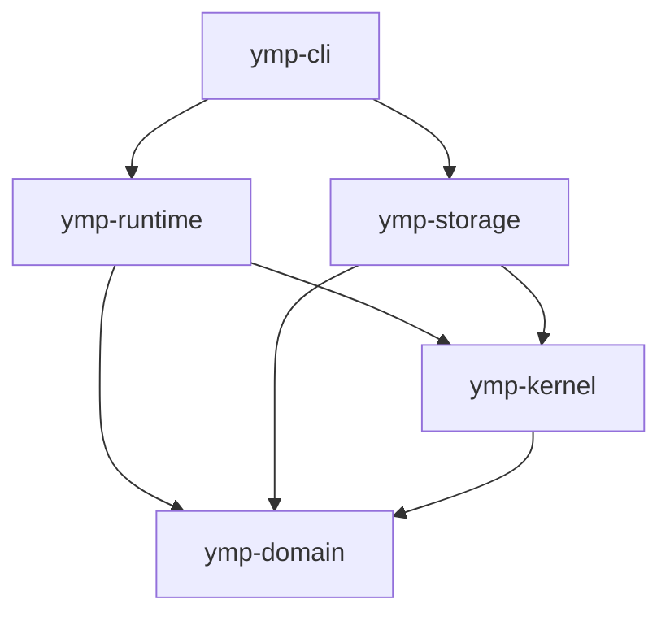

# Historical implementation architecture notes

The approved [self-organizing team model](self-organizing-team-domain-model.md)
is the single authoritative architecture and product scope. This document
retains boundaries and mechanics from an earlier implementation. They are not a
ready baseline, required new crate layout or delivered functionality of the new
iteration. The implementation starts from scratch under the approved model.

## Responsibility

YMP separates task meaning, trusted decisions, external effects and presentation.
The kernel owns admission and state transitions. Replaceable strategies can choose
how to work without choosing which rules to bypass.

The crate dependency graph of that earlier implementation was:

| Crate | Owns | Must not depend on |
| --- | --- | --- |
| `ymp-domain` | Identifiers, values, task contracts and pure validation. | I/O, runtime, storage implementations or presentation. |
| `ymp-kernel` | Trusted lifecycle, event projection, typed service ports and denials. | Concrete journal/provider implementations, CLI or runtime assembly. |
| `ymp-runtime` | Application assembly and adapters implementing kernel ports. | Presentation packages. |
| `ymp-storage` | The durable SQLite `Journal` adapter and strict event payload codec. | Runtime assembly or presentation. |
| `ymp-cli` | Command parsing, adapter selection, process exit status and terminal output. | Direct journal writes or authority decisions outside runtime/kernel APIs. |

`MemoryJournal` remains the in-process reference adapter in `ymp-runtime`.
`SqliteJournal` is the durable adapter in `ymp-storage`; the CLI selects it and
injects clones into `Application` and `ExecutionScenario`. Provider adapters live
in `ymp-runtime`. The repository introduces a dedicated crate only when it has an
executable responsibility.

## State and decisions

`Journal` appends a batch to one session stream against an expected revision.
Comparison and append are atomic: a stale revision or rejected batch changes
nothing. Reads return a coherent ordered history. Kernel projection validates the
history and produces a `SessionView`; a malformed history is an error, not a
successful empty session.

State transitions record facts. The event schema is independent of terminal
messages. A user-facing explanation cannot substitute for the authoritative
decision or its evidence.

For model-assisted decisions, retain the policy version, the actual supplied
input and the observed response. Reconstructing a decision means resolving those
records, not expecting a repeated model call to return identical text.

## Authority and effects

An assignment requires current eligibility, supported settings, independence,
available resources and enforceable workspace access. These checks belong to
trusted admission, including the final atomic check against current state.

Database commit and native process execution have different failure boundaries.
Record admitted, started, cancelling, terminated and uncertain states explicitly
when execution is implemented. Revoking a grant does not prove that a process has
stopped writing. A conflicting successor waits for the required termination or
effect evidence.

Unknown resource usage is not zero. All admitted work, including coordination,
failed attempts, verification and learning, belongs to the session's accounting.
Reservations protect concurrent admission, verification and reporting capacity; they do not
promise native limits that the provider cannot enforce.

## Acceptance

Independent review, criterion satisfaction and confirmation remain separate.
Applicable failures cannot be overruled by agreement. Evidence covers exact
versions of the result, criteria and checker. Acceptance and credit are committed
by the kernel after those bindings have been validated.

Finalization requires stable result contents and resolution of relevant running
work. Reports state unmet conditions and uncertainty. Optional knowledge
preparation should have a durable, bounded lifecycle that does not hold up delivery.

## Extension boundaries

Add a port when two useful implementations need the same enforced contract.
Do not make every helper a strategy. Start with simple deterministic policies;
estimated value, calibrated routing and experience-based choices need data before
their effectiveness can be claimed.

Native model discovery supplies actual identifiers and supported controls.
Authentication stays in the native environment. Adapters must preserve typed
failure causes, invocation attribution and incomplete observations.

The earlier implementation provided durable session state, one bounded native
Codex invocation and preliminary criterion evaluation by a caller-supplied
command. That code was removed from the working tree for the new iteration and
remains reachable only at the git tag `legacy-foundation`; nothing from it is
credited as implemented. The product exposes one native executable; development
tools are not automatically application runtime dependencies.
