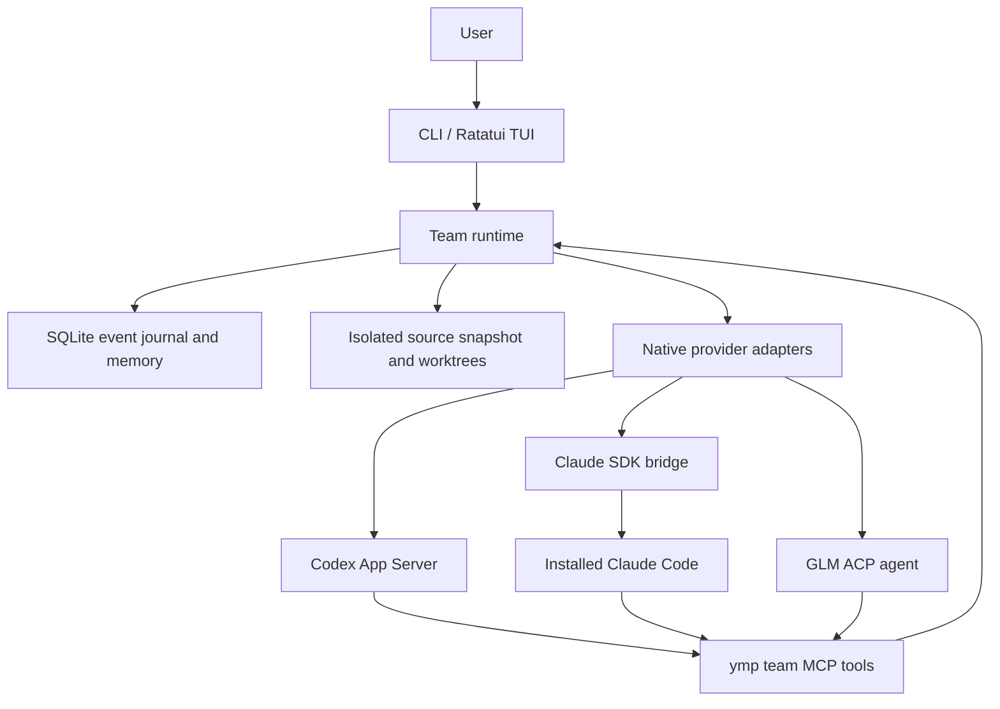

# System architecture

The root Cargo workspace contains seven packages. `ymp-core` defines profiles, tasks, plans, memory, and reputation without dependencies on terminal rendering or providers. `ymp-storage` owns SQLite and migrations. `ymp-providers` implements native process protocols. `ymp-workspace` manages isolated source snapshots. `ymp-runtime` coordinates these components. `ymp-tui` presents events and user actions; `ymp-cli` composes the application and exposes headless commands.

Provider output is normalized before it reaches the UI. The UI can be absent during headless execution. Shared chat is durable; incremental text is transient until the corresponding final response is saved. A message does not implicitly approve a task or schedule every participant.

Profiles and tasks are different entities. A profile may execute, plan, or review different tasks. A session captures its team profile snapshot. Native provider session identifiers are stored separately from application session and task identifiers.

## Workspaces

A run copies tracked and non-ignored untracked source files into an application-owned snapshot repository. Deleted source files remain deleted in the snapshot. Git history and provider credentials are not copied. For ordinary directories, generated directories such as `node_modules` and `target` are excluded.

Each execution attempt receives a detached worktree based on the current integrated result. Independent attempts may execute concurrently. Results are integrated sequentially, including all commits made by the agent since the attempt's base. A conflict preserves the candidate and requests a revision against the updated integrated base. The source repository is never reset, stashed, or rewritten.

Snapshot worktrees separate ordinary file changes; they are not OS sandboxes. Provider permission modes determine available operations. Review/planning turns request read-only behavior, while execution turns use unattended permissions. External side effects cannot be rolled back by Git.

## Stopping and recovery

Each native process is owned by a short-lived supervisor in a separate process group. Closing the host's stdin, including after abrupt host termination, causes the supervisor to close the native process and terminate remaining members of its group. The supervisor is not a service and cannot accept new work after the host exits.

A persisted session can exist without a running provider process. Native sessions are resumed using their provider identifiers; the current implementation releases the provider process after each turn. A cancelled or interrupted execution is inspected before resuming. Unknown outcomes are never treated as successes solely because no error was recorded.

Session locks prevent two application instances from running the same session. Process/protocol failures do not count as failures of an agent's task competence.
