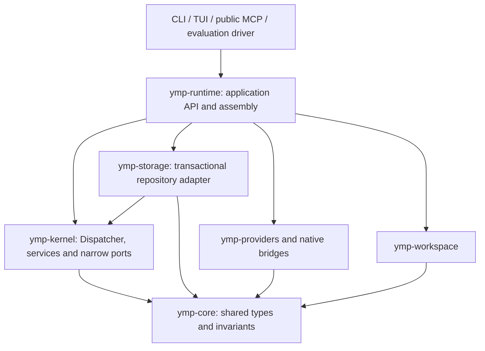
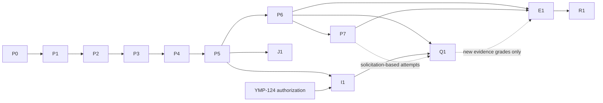

# Migration plan: incremental kernel transition

Status: proposed implementation plan, 2026-09-15. Prepared under
[YMP-169](../../tasks/README.md#ymp-169) at the owner's request.
Completing this document means planning is delivered, not that the architecture
is approved or any migration phase has started. Phase IDs below are local plan
identifiers, not newly scheduled implementation tasks.

The plan defines the transition to the
[target domain model](self-organizing-team-domain-model.md). The approved
[intent](../../../intent.md), existing runtime contracts and owner constraints
remain authoritative where the proposal differs.

## 1. Decision and deliverables

Build a new `ymp-kernel` crate inside the current Cargo workspace. Introduce a
small executable boundary, preserve existing adapters and transactional commands,
then replace the session orchestration. Separate this structural transition from
changes to coordination, evidence grades and learning policies.

The work has three independently assessable outcomes:

| Outcome | Delivered behavior | Completion boundary |
| --- | --- | --- |
| A — Structural migration | Existing product behavior runs through the new kernel; clients retain supported history and control semantics. | P0-P5; the old Engine orchestration is retired only after compatibility and invariant checks. |
| B — Criterion-directed coordination | New work addresses an unmet requirement or missing evidence; admitted proposals change execution; delivery precedes optional knowledge preparation. | P6-P7; useful behavior is demonstrated with scripted providers. |
| C — Extended target | Journal-derived state, stronger verification, isolated attempts and evidence-informed policies become available through the same boundaries. | J1, I1, Q1, E1 and R1, under their explicit prerequisites. |

Outcome A is not full v3 conformance. Outcomes B/C do not establish a quality,
cost or speed advantage merely because their protocols work. Such claims need
the separately authorized comparisons in section 10.

A separate project is not selected: the valuable low-level implementations already
have crate boundaries, while the difficult coupling is in orchestration, storage
authority and its consumers. Copying these modules would preserve that coupling
and introduce a second integration/release path. Reconsider an independent project
only if P1 establishes a specific boundary that cannot be introduced incrementally,
or the owner deliberately chooses a separate product/compatibility contract.

## 2. Baseline and source map

Planning baseline: `aa98c24`, workspace version `0.4.6`. Re-read Git and the task
register before any future implementation assignment, and preserve existing
workspace changes.

Approved intent SHA-256:
`4479e919c5b47934e69e81ac493d16e90a0dc420a9a370382e79bca3f3c754d9`.

| Responsibility | Current evidence | Treatment |
| --- | --- | --- |
| Shared domain and authority | [ymp-core](../../../ymp-rust/crates/ymp-core/src/lib.rs), [confirmation types](../../../ymp-rust/crates/ymp-core/src/confirmation.rs) | Retain existing types and pure validation; add new records selectively. |
| Native execution | [ExecutionBackend](../../../ymp-rust/crates/ymp-providers/src/backend.rs), [guarded execution](../../../ymp-rust/crates/ymp-providers/src/lib.rs), `ymp-bridges` | Reuse implementations, authentication, controls, cancellation and usage normalization. |
| Durable authority | [admission and trace](../../../ymp-rust/crates/ymp-storage/src/provenance.rs), [confirmation](../../../ymp-rust/crates/ymp-storage/src/confirmation.rs), [budget](../../../ymp-rust/crates/ymp-storage/src/budget.rs) | Preserve transaction boundaries, error causes and current accounting. |
| Workspace effects | [access algebra](../../../ymp-rust/crates/ymp-core/src/workspace_access.rs), [reservation ownership](../../../ymp-rust/crates/ymp-runtime/src/reservation.rs), [workspace](../../../ymp-rust/crates/ymp-workspace/src/lib.rs) | Preserve effective backend guarantees and direct-directory behavior. |
| Orchestration | [Engine](../../../ymp-rust/crates/ymp-runtime/src/engine.rs) and `engine/*` | Extract into Dispatcher plus the existing workflow as a baseline strategy. |
| Existing strategy boundaries | [allocation](../../../ymp-rust/crates/ymp-runtime/src/allocation.rs), [recovery](../../../ymp-rust/crates/ymp-runtime/src/recovery.rs), [checker](../../../ymp-rust/crates/ymp-runtime/src/checker.rs) | Adapt proven interfaces; do not create a competing policy framework. |
| Product consumers | [public MCP](../../../ymp-rust/crates/ymp-runtime/src/public_mcp.rs), [TUI state](../../../ymp-rust/crates/ymp-tui/src/state.rs), [evaluation projections](../../../ymp-rust/crates/ymp-eval-driver/src/restart_projection.rs), `ymp-cli` | Include all consumers in versioned read/command compatibility. |

The current planner decomposes work upfront, can propose up to eight tasks, and
can use two initial planners for a complex request. It is not behaviorally
equivalent to the target `AsNeededDecomposition`, which splits after failure.
The baseline strategy below is named `LegacyWorkflow` in this plan only; its
registered identifier/version will be defined in P0.

`Store::trace()` is a transactionally consistent combination of current tables
and history. It is not a reconstruction from the journal alone. P1 preserves
this honest hybrid contract; J1 supplies the separate event-derived contract.

## 3. Proposed dependency direction



`ymp-kernel` must not depend on `ymp-runtime`, `ymp-storage`, UI or concrete
providers. Storage may implement repository traits declared by the kernel;
the kernel cannot call back into Engine. Runtime assembles provider/workspace
adapters around the existing execution/reservation interfaces. This avoids a
dependency cycle without moving all shared types into a second domain crate.

Start with four responsibilities, split further only where a real replacement
requires it:

1. A versioned repository/query boundary for coherent views and atomic commands.
2. An invocation host that owns workspace admission, native execution,
   termination observations and terminal accounting.
3. A check/evidence adapter around existing confirmation execution and capture.
4. A coordination strategy receiving immutable typed views and returning bounded
   proposals; existing allocation/resource/recovery strategies remain reusable.

Registry, Treasury and AcceptanceAuthority are logical service responsibilities,
not a requirement to create a crate or trait for every noun in the target.
Use existing libraries and compiled injection. No new external runtime, generic
service container, dynamic plugin ABI or locally installed Git dependency is
introduced. Native provider/runtime dependencies remain the existing exception.

## 4. Invariants and the single acceptance criterion set

These criterion IDs apply throughout planning, implementation and final analysis.
Each phase selects the relevant rows; a check outside its scope is not exercised,
not implicitly successful. Phase-specific observations fill the same records.
The linked existing tests are optional sources of evidence and examples, not
mandatory retained assets. Any of them may be deleted under section 10.1.

| ID | Required property | Existing evidence / smallest discriminating check |
| --- | --- | --- |
| K1 | Admission validates current pins, membership, independence and revisions; assignment, grant, resource reservation and event commit atomically. | [storage provenance tests](../../../ymp-rust/crates/ymp-storage/src/provenance_tests.rs); inject a write failure after validation and require no partial admission. |
| K2 | Every admitted invocation retains spend, reservation and coverage through retries, cancellation and late observations; settlement is idempotent. | [budget authority tests](../../../ymp-rust/crates/ymp-runtime/src/budget_authority_tests.rs); duplicate receipt and unknown-usage boundaries. |
| K3 | Effective backend access governs conflicts; revoke/expiry never proves termination; uncertain writers retain an explicit hold. | [workspace reservation tests](../../../ymp-rust/crates/ymp-runtime/tests/workspace_reservation.rs), [concurrency tests](../../../ymp-rust/crates/ymp-runtime/tests/concurrency.rs); cancel a writer before admitting a successor. |
| K4 | Restart preserves verified work, owner pauses, unresolved effects and current attempts; it cannot silently replay an uncertain writer. | [recovery tests](../../../ymp-rust/crates/ymp-runtime/tests/session_recovery.rs) and its rework modules; reopen a paused/uncertain session. |
| K5 | Independent acceptance refers to the exact current result, criteria and evidence; accepted/unconfirmed earns no success credit; failed applicable checks dominate approvals. | [confirmation tests](../../../ymp-rust/crates/ymp-runtime/src/engine/confirmation_tests.rs); change result/check source after evidence capture. |
| K6 | Original requirements and explicit owner constraints survive replanning; native IDs, settings and historical membership retain their captured meaning. | [board coordination](../../../ymp-rust/crates/ymp-runtime/tests/board_coordination.rs), [pool identity](../../../ymp-rust/crates/ymp-runtime/tests/pool_identity.rs); stale revision and changed settings controls. |
| K7 | A strategy cannot write state or invoke a model outside ordinary admitted work; decisions retain implementation/version and recoverable input references. | Two materially different strategies through the same real consumer; reject an inadmissible proposal. Reuse existing substitution evidence. |
| K8 | CLI, TUI, public MCP, statistics and evaluation consumers preserve supported reads/commands and unknown historical state. | Archived v1/v3 records through actual readers; incompatible versions fail explicitly without mutation. |
| K9 | Completion requires settled relevant work, a stable final artifact and independent final acceptance; narration/learning failures do not fabricate success or erase accepted work. | Existing final-review/narration failure tests; finish while a conflicting writer is still active and require deferral. |
| K10 | Knowledge retains source/version/scope, qualified retrieval, correction history and idempotent credit; later signals do not create unsupported competence observations. | Existing knowledge/correction tests; stale knowledge and duplicate or unrelated consequence controls. |

A scripted positive result alone does not establish fault handling. Choose the
smallest evidence that answers the phase's actual acceptance question; this may
be a focused disposable check, an observation through a real consumer, or review
appropriate to the change. Before relying on a new assertion, demonstrate that
it rejects its corresponding invalid case. There is no obligation to preserve
or recreate a deleted suite, or to add a permanent test for every criterion.
All K1-K10 have a final evidence disposition, with untested claims kept explicit.

## 5. Operational and persistence contracts

### 5.1. Atomic admission and external effects

Pure validation may move into core/kernel. Validation against mutable state must
be repeated inside the same SQLite transaction as the write, using the expected
session/task/policy revisions. Initially wrap
`Store::admit_invocation_with_grants`; do not replace it with independent
`validate`, `reserve`, `grant` and `insert` calls.

The invocation host first holds an opaque workspace reservation, then commits
durable admission, then starts the recorded native request. The binding covers
agent, provider, settings, prompt, access and limits. Failure before commit releases
the unspent reservation. Failure after commit records the actual terminal or
uncertain state; it must not refund already consumed or unknown resources.

Database commit cannot atomically start/stop a process or restore files. Record
enough state to distinguish not-started, started, cancelling, terminated and
unknown execution effects after interruption. Revoke live team authority promptly;
release filesystem ownership only when the host has the required termination/effect
evidence. A lease can expire while that hold remains. Reassignment uses a fresh
assignment ID after the hold is resolved. Preserve native detached-effect limits.

### 5.2. Views and journal

The P1 hybrid view contains its schema version, session revision, observed journal
sequence, captured policy/configuration references and canonical input digest.
Persist the exact strategy input or a durable content-addressed reference; a hash
without retained input is insufficient. Capture time, random choices and model
observations used by decisions. Reconstructing a recorded decision does not mean
re-running nondeterministic inference to obtain the same answer.

Entity tables remain authoritative in this transitional contract. Do not call
them rebuildable caches before J1 proves reconstruction. Journal/record changes
stay atomic. Legacy unknown fields and missing provenance remain unknown.

J1 defines a versioned initial checkpoint/import event plus complete subsequent
events for the new session format. Its acceptance requires rebuilding views from
that retained history and comparing them with the live projection. It does not
invent events for missing legacy history or replay external effects.

### 5.3. Acceptance and completion

Track separately: requirement satisfaction, independent acceptance, confirmation
basis and advisory belief. A probability threshold cannot replace required
evidence. Keep the existing confirmed-only success-credit rule throughout A/B;
an expanded `CreditPolicy` needs a separate owner decision before activation.
Legacy `Unknown` remains distinct from accepted/unconfirmed. New grade projections
must retain the recorded historical value and basis; they cannot retrospectively
confirm results or increase reputation.

Before final capture, stop admitting obsolete work, resolve or hold outstanding
assignments, drain conflicting writers and settle known usage. Final checks and
review bind the same artifact and contract versions. A check hash does not retain
its executable source; generated evidence must use the YMP-166 retention/access
contract when that work is accepted.

P6 separates report delivery from optional learning. Persist any pending learning
job and its remaining allowance before delivery; it may continue in the same
process or resume on the next supported application run. Process exit leaves it
pending, not completed. It cannot restart production, exceed the session budget
or require a new background daemon. Failed narration uses the existing truthful
fallback. Required owner control remains effective after report delivery.

## 6. Structural migration phases

Phase headings describe change risk. The following ranges separately estimate
engineering effort; they are initial planning judgments, not measurements or
calendar commitments. Refine them after P0/P1 and each accepted increment.

### 6.1. Preliminary effort ranges

One engineering day means eight hours of effective work by an engineer familiar
with Rust and this codebase. The ranges include authoring, integration, review and
focused acceptance. They exclude waiting for owner decisions, unfinished upstream
tasks, native experiments and long-term data collection. They are not estimates
of model-running time and cannot be divided by the number of agents.

Size scale: S up to 2 engineering days; M over 2 to 5; L over 5 to 10; XL over 10.
A range crossing a boundary has two labels. Confidence is low before the first
kernel slice; these ranges are meant to support sequencing and allocation.

| Phase | Implementation/design | Integration and focused acceptance | Total / size | Main source of uncertainty |
| --- | ---: | ---: | --- | --- |
| P0 | 0.5-1 | 0.5-1 | 1-2 / S | Saved-state inventory and explicit contract decisions. |
| P1 | 1-2 | 0.5-1 | 1.5-3 / S-M | Whether current admission types fit the kernel boundary. |
| P2 | 3-5 | 1-3 | 4-8 / M-L | Termination, uncertain effects and atomic owner commands. |
| P3 | 4-7 | 2-3 | 6-10 / L | Splitting workflow rules from trusted transitions. |
| P4 | 3-6 | 2-4 | 5-10 / M-L | Legacy continuation states and all public consumers. |
| P5 | 1-2 | 1-2 | 2-4 / S-M | Removing bypasses, packaging and release compatibility. |
| P6 | 3-5 | 1-3 | 4-8 / M-L | Criteria/evidence selection and durable post-delivery work. |
| P7 | 4-7 | 2-3 | 6-10 / L | Actual proposal-to-assignment effects and commitment lifecycle. |
| J1 | 4-7 | 1-3 | 5-10 / M-L | Completeness of checkpoint/event data and schema evolution. |
| I1 | 5-10 | 3-5 | 8-15 / L-XL | Workspace guarantees and interrupted publication. |
| Q1 | 5-10 | 3-5 | 8-15 / L-XL | Real visibility isolation and retained executable checks. |
| E1 | 3-6 | 2-4 | 5-10 / M-L | Receipt normalization and trustworthy outcome attribution. |
| R1 | 2-4 | 1-2 | 3-6 / M-L | Integrating the already evaluated policy and fallback. |

Outcome A totals approximately 20-40 engineering days; P6/P7 add 10-18. These
are sums of effort, not elapsed delivery dates. Do not quote a completion date
for the extended target while isolation authorization and outcome data are absent.

The ranges do not budget compulsory repair or migration of the current 668 Rust
test attributes. Existing tests may be retained when cheap, or removed immediately
when their maintenance obstructs the change. Dropping them can remove adaptation
work; it does not automatically remove implementation, integration or diagnosis
work. Revise the range for the actual chosen approach instead of promising an
unmeasured percentage saving. Moving source files alone is not the size measure.

### P0 — Freeze the executable migration contract (moderate)

**Entry:** owner selects this implementation direction. Current request authorizes
this plan only. Reconcile the task register without starting unrelated work.

**Work:** capture the accepted code baseline and compatibility matrix; map current
Engine transitions to K1-K10, consulting existing tests only where useful; define `LegacyWorkflow`, port ownership,
versioned commands, effect lifecycle and unsupported-state errors. Record target
amendments in section 9 as decisions. Inspect already accepted YMP-158/160/166
changes before extracting any overlapping code; unaccepted branches are not a
baseline. A preserved absence must be labeled, not described as delivered work.

**Exit:** each old public operation/state and each changed invariant has an owning
adapter and acceptance case; the proposed crate dependencies are acyclic; no
unresolved authority/lifecycle ambiguity remains for P1. Existing implementation
task prerequisites still apply unless the owner explicitly resequences them.

### P1 — Prove one kernel boundary (moderate; first implementation)

**Depends on:** P0. **Scope:** create `ymp-kernel`, the hybrid read view and a narrow
transactional admission adapter. Keep the old Engine as the active orchestrator.
Route one existing scripted invocation through this boundary; do not create the
entire service catalog or change planning/acceptance behavior.

**Exit:** the positive invocation preserves captured identity, spend, grants and
result. A forced transaction write failure leaves no partial assignment, grant or
budget change. An incompatible/stale revision is rejected. The exact strategy
input can be recovered. K1, K2, K6 and K7 apply.

**Decision:** continue only if the seam works without a dependency cycle or copied
provider/storage implementation. If it fails, record the concrete obstruction
and revise the boundary before broad extraction or proposing another repository.

### P2 — Extract lifecycle ownership and trusted commands (high)

**Depends on:** P1. **Scope:** move orchestration-independent admission, terminal
accounting, owner controls and recovery transitions behind the shared kernel/host
boundary. Keep SQLite authority transactional. Route Engine and public command
entry points through these same operations before replacing the workflow.

**Exit:** cancellation, owner pause, lease-like expiry, late receipt and restart
preserve K1-K6 and K9. A successor cannot overlap an uncertain writer. Budget
settlement and command receipts are idempotent. Typed causes remain available to
clients. No strategy holds a mutable Store. Unrelated catalog preferences and
file-navigation actions remain in their existing owners.

### P3 — Run the current workflow through Dispatcher (high)

**Depends on:** P2 and the retained prerequisites of YMP-148 (section 8).
**Scope:** extract the actual plan/proposal review, upfront decomposition, task
waves, result review, recovery, final review, learning and narration order into
`LegacyWorkflow`. Dispatcher handles event waiting and action/result routing;
kernel services enforce authority. Existing strategies are adapted, not renamed
into semantically different target defaults.

Start with an internal selection bound immutably to each new test session. One
session has one scheduler, one resource ledger and one workspace owner. Compare
old/new scripted executions in separate fixture directories and application
homes; never execute both schedulers against the user's working directory.

**Exit:** semantic parity for K1-K7, K9-K10 on the selected scenarios: accepted or
blocked outcomes, admitted work, confirmation, resource coverage, owner control
and recovery. Normalize generated IDs/timestamps; preserve meaningful provenance
relations rather than requiring identical event ordering. Reuse YMP-148's existing
runner and substitution criteria. No native performance comparison is implied.

### P4 — Migrate clients and supported legacy continuations (high)

**Depends on:** P3 and accepted statistics/API contracts being consumed.
**Scope:** introduce one versioned application read/command facade for CLI, TUI,
public MCP, statistics and evaluation-driver projections. Preserve the public v1
wire format through an adapter until an explicit replacement contract is selected.
Internal additive event kinds are not assumed compatible with every enum parser.

Inventory saved states of the baseline. Implement version-bound translation of
each supported quiescent v1 continuation into kernel state, preserving its
original policy, result versions, attempts, history and uncertainty. Active native
work is never translated mid-call. Do not move a v1 session to a different workflow
merely because a global default changed.

**Exit:** K4-K10 pass through actual client readers/commands and imported saved
states. Read-only access causes no migration/inference. Stale owner actions fail
without mutation. An unknown or corrupt version produces a typed compatibility
error; a supported baseline state cannot be silently dropped as an optimization.
UI implementation and visual checks use the required Claude Code assignment.

### P5 — Switch new sessions and retire old orchestration (high)

**Depends on:** P4 and independently accepted K1-K10 dispositions.
**Scope:** select the new kernel for new sessions; retain imported session bindings.
Delete the old Engine implementation only after all supported v1 continuations
run through the accepted translation/kernel path. A remaining whole legacy Engine
means this phase is incomplete, not a finished migration with permanent duplication.

**Exit:** no product client or command path bypasses the new session authority;
old Engine orchestration is absent; legacy readers and required continuation
adapters remain; accepted work and native attribution survive reopen. Repository
checks, relevant bridge/consumer checks and release compatibility checks pass.
Installing a build or migrating the owner's live application home is a separate
concrete publication/migration action, governed by its existing authorization.

Outcome A is complete here. Do not claim that self-organization, hidden checks,
event-derived replay or calibrated routing were delivered by this extraction.

## 7. Target behavior increments

| ID / risk | Dependencies and work | Exit / acceptance | Deliberately deferred |
| --- | --- | --- | --- |
| P6 — Criterion-directed work (high) | P5; integrate the accepted YMP-166 evidence facility. Add requirement/evidence projections, deterministic contribution selection and the durable post-delivery learning lifecycle from section 5.3. Preserve original criteria through revision. | A scripted candidate that already implements a requirement receives missing verification instead of duplicate production; an unmet requirement still receives production. K5/K7/K9/K10 hold. Report delivery is observable while optional learning remains pending. | No belief-based acceptance, new credit grades, mandatory bidding or calibrated cost claims. |
| P7 — Admitted self-organization (high) | P6 and YMP-148's accepted substitution contract. Add contribution proposals, solicitations, offers and commitments incrementally. Begin with deterministic runtime-proxy offers; model-written offers use existing admitted assignments or explicitly charged bidding work. | A proposal changes admitted work; an invalid/stale offer is rejected; an expired commitment reopens work only after the existing execution hold allows it. K1-K7 apply. Two different strategies use the same kernel. | Probabilistic volunteer thresholds and sealed native attempts wait for evidence and I1. |
| J1 — Event-derived v3 views (high) | P5 and stable command/event schemas; may proceed independently of P6/P7 with isolated writes. Add versioned checkpoint/import events and complete transition events for v3 sessions; retained input blobs are referenced durably. | Rebuild the same versioned view from checkpoint plus events after deleting only disposable test projections; replay starts no native calls and changes no files. K4/K7/K8/K10 apply. Include late usage and regrading schemas when those increments land. | Missing legacy provenance is not reconstructed or rewritten as certainty. |
| I1 — Isolated work and recoverable publication (high) | P5 plus separate authorization and acceptance of YMP-124; currently paused. Reuse its workspace/access contract for ordinary directories and optional embedded Git implementations. | Exact reviewed candidates can be materialized, checked and published with conflict detection and interruption recovery; user changes survive. Native visibility/effect limits are explicit. K3-K6/K9 apply. | No automatic unpausing of YMP-124 and no claim that a file copy is a native permission sandbox. |
| Q1 — Stronger evidence and independent attempts (high) | P6, I1, accepted YMP-166; use P7 for solicitation-based attempts. Add retained independently authored checks, enforceable hidden contexts, mutation checks, explicit evidence grades and result selection. | A deliberately faulty candidate is rejected; a non-discriminating check is identified; producers cannot obtain declared hidden inputs through prompts, board/tools, files or native continuation. Mutants do not alter the accepted directory. K3/K5-K9 hold. | Where a backend cannot enforce the claimed visibility, mark the mode unavailable; do not silently downgrade it and retain a hidden label. |
| E1 — Qualified experience and advisory cost (high) | P6/P7 and outcome data with traceable confirmation; Q1 is required only for observations using its new evidence grades. Add forecast calibration, price/usage normalization, delayed consequences and scoped knowledge trials in separately reviewable pieces. | Duplicate/irrelevant consequences create no duplicate or unsupported credit; insufficient data remains explicitly uncalibrated; partial usage cannot become a cheap complete receipt. K2/K5/K7/K10 hold. | Real With/Without trials need their own approved cases/quota. Preserve the current confirmed-only rule unless explicitly revised. |
| R1 — Evidence-informed routing (moderate implementation, high evidence risk) | E1 and an accepted matched evaluation demonstrating usable forecast/cost information. Add calibrated contribution/routing strategies behind existing ports, with a deterministic fallback. | The strategy changes real admitted choices under the same constraints; lack of data selects the declared fallback. K1-K10 hold. Any efficiency claim passes the corresponding intent criterion in section 10. | A paper citation, heuristic probability or one successful session is not enough to activate an optimization as proven. |

P6 includes versioned criterion extraction, capability-aware verification requests,
progress/diagnosis-driven next actions, and report claim auditing. Reports distinguish
execution, source inspection and browser evidence, cite their result versions, and
state the tested scope. Unsupported causal or universal claims are narrowed or
marked unknown. Original owner requirements cannot disappear through an agent's
reclassification. These checks share the existing evidence store and K5/K6/K9.

P7 covers the target's status notices, objections, context handoffs and
clarify-or-assume protocol as well as offers and commitments. A notice triggers
an admitted decision; it cannot directly satisfy or remove a criterion. An
objection is resolved against applicable evidence, with a counterexample when
available. Handoffs retain decision/evidence references; assumptions remain
visible in the report. The target's sealed independence-window protocol belongs
to Q1 after I1, not to the unisolated part of P7.

P7 must distinguish a trusted proxy submission from an agent operation requiring
a grant. Eligible idle offer candidates and participants making proposals during
an active assignment are different sets. Bootstrap planning uses ordinary bounded
runtime admission, not an offer that recursively requires a prior award. Define
these paths before introducing their public operation names.

Profile/family/strength selection uses native scan metadata and qualified recorded
experience. Missing metadata remains unknown; it is not supplied from a handwritten
model table. Unsupported profiles and unresolved aliases do not become selectable
through the migration. Existing confirmed effort and binary controls retain their
distinct captured meanings.

The target service mapping is explicit: Registry reuses catalog/identity behavior
through P2 and accepted YMP-167 readiness; Treasury and Gatekeeper use P1/P2;
WorkspaceGuard uses P2/I1; AcceptanceAuthority uses P2/P6/Q1; Arbiter uses P3/P7;
ExperienceVault preserves existing behavior in P2/P3 and extends it in E1;
Dispatcher is P3; Journal/View is P1 followed by J1. Existing context, retrieval,
resource and recovery strategies are adapted in P3 before P6/E1/R1 change their
behavior. This mapping does not require implementing every proposed port as a
distinct abstraction if the approved shared interface already owns its behavior.

## 8. Sequencing and existing task ownership



Solid edges are required dependencies; dotted edges are conditional extensions.
The table in section 7 also records task, data and evaluation prerequisites. J1 is required for full target D-4 conformance, even if other behavior
increments are delivered first. Full target closure requires all listed target
responsibilities to be implemented and accepted or explicitly revised by the
owner; a paused capability cannot be counted as delivered.

### 8.1. Coverage of the target build stages

The stages below are the numbered stages in
[section 10 of the target model](self-organizing-team-domain-model.md#10-build-order).
A migration phase may preserve an existing capability before a later phase adds
the target semantics. A partial correspondence does not close the target stage.

| Target stage | Migration phases / dependencies | What closes the stage |
| --- | --- | --- |
| 1 — Journal, Store, types and views | P1 provides hybrid views; J1 supplies complete event-derived v3 projections. | J1 rebuilds the same view from a retained checkpoint and events; two equal live reads are insufficient. |
| 2 — Registry, scripted execution and readiness | P1/P2 reuse execution and identity boundaries; accepted YMP-167 supplies selected-adapter readiness. | A scripted invocation runs through admission, and a missing required adapter is reported before inference. |
| 3 — Treasury, cost model and resource policy | P1/P2 preserve current resource accounting; E1 adds normalized receipt costs. | Reservations, usage coverage and CostModel agree. If CostUnits are to become an authoritative limit, their admission/overshoot semantics must be accepted separately; advisory cost alone does not close that part of the target. |
| 4 — Workspace, checks and acceptance | P2 preserves direct access and trusted acceptance; P6 adds criterion status; Q1 adds graded evidence. | Independent exact-version acceptance and explicit grades work through the shared services. The P0 decision that belief is advisory must be reflected in the target contract. |
| 5 — Minimal executable kernel | P2/P3 supply lifecycle and Dispatcher; P6 supplies criteria-directed progress, reporting and diagnosis; P7 supplies target commitments. | The target producer/reviewer/criteria/diagnosis/report workflow runs with admitted commitments. `LegacyWorkflow` parity alone does not close this stage. |
| 6 — Hidden design, mutation and discrimination | Accepted YMP-166, I1 and Q1. | Check material is retained, the declared hidden scope is enforced and faulty candidates/non-discriminating checks are detected without changing accepted files. |
| 7 — Self-organization protocols and policies | P7 provides protocols; Q1 supplies sealed windows; E1/R1 supply data-informed ranking where selected. | Notices, offers, objections, handoffs and role/profile decisions affect admitted work. Unavailable isolation or uncalibrated selection remains explicit; an unimplemented default is not counted as delivered. |
| 8 — Independent attempts and selection | I1/Q1; P7 when attempts use solicitations. | Isolated candidates are checked against the same criteria, selected and published recoverably. |
| 9 — Accumulated experience | Existing experience preserved by P2/P3; P6 separates delivery from learning; E1 adds calibration, trials and consequences. | Qualified observations, correction, retrieval and trial records work; actual learning benefit requires the declared longitudinal evidence. |
| 10 — Data-informed method/contribution routing | E1 and R1, plus usable calibration data and accepted comparative evaluation. | Routing changes real admitted decisions under unchanged constraints and uses its declared fallback without sufficient data. |

Default strategy names in the target are not treated as implementation evidence.
If a different policy remains the chosen default, record that target decision;
otherwise the missing default remains outstanding. This table prevents Outcome A
from being mistaken for closure of all ten target stages.

### 8.2. Existing task ownership

| Existing work | Relationship to this plan |
| --- | --- |
| YMP-158, YMP-160 and YMP-162 | Retain current statistics, selection and recovery/release ownership. P0 refreshes their accepted baseline; P3 cannot bypass YMP-148's unfinished prerequisites simply by using a new phase name. This document does not start YMP-162's native stages. |
| YMP-166 | Owns reproducible reviewer-visible generated verification. Integrate its accepted result for P6/Q1; do not create a second evidence store. It is in progress at the planning baseline. |
| YMP-167 | Owns selected-adapter readiness and typed missing-component errors. Reuse it when accepted; kernel extraction does not silently implement or claim it. Readiness behavior must be settled before releasing a target that promises it. |
| YMP-148 | Owns coordination replacement and its scripted comparison. P3/P7 elaborate that scope; register an approved decomposition or amend the task, not duplicate completed work or bypass its dependencies. |
| YMP-150 | Owns /team strategy selection. P4 provides the backend facade; UI changes stay with this task and the designated Claude Code implementer. No generic policy settings page is added. |
| YMP-124 | Owns I1. Its paused status and independent authorization remain intact. |
| YMP-201/202/203/204 | Existing research remains paused as recorded. Reuse relevant accepted fixtures; new comparative inference is separately planned and authorized. No prohibited model is launched or substituted. |

Only YMP-169 records the present planning deliverable. On approval, register or
reconcile the selected first implementation phases and generate task views with
`manage.py`; do not mark the complete table ready merely because agents are free.
Parallel implementation uses isolated development worktrees for independent
writes. Parent owns contracts, integration and final acceptance; bounded execution,
builds, tests and independent reviews use background Paseo forks with completion
notifications. UI implementation uses `claude-opus-5` with thinking `high`.

## 9. Contract decisions for P0

P0 records the accepted dependency direction, transactional command boundaries,
execution lifecycle and compatibility contract from sections 3-5. The current
workflow remains the behavioral baseline during extraction. Hybrid views are
transitional; J1 establishes event-derived state.

Requirement satisfaction and acceptance follow deterministic evidence and authority
rules. Belief remains advisory, and success credit requires confirmation. These
rules must be reflected in the target contract before implementing the affected
behavior. Hidden verification follows enforceable isolation and retained evidence.

Any existing tests may be deleted when that simplifies migration, without a
mandatory retention or replacement quota. Product requirements and runtime
validation remain in force; choose focused evidence for the changed behavior.
Supported continuations and clients move to the kernel before Engine is retired. Calibrated defaults require
adequate outcome data and an accepted evaluation. Optional future policy decisions
do not block unrelated structural work once that work is authorized. Producing this
plan does not itself approve or modify the target architecture.

## 10. Verification, compatibility and rollout

### 10.1. Checks appropriate to the change

The [optional file-level inventory](migration-test-inventory.md) records 77
test-bearing Rust files and 668 test attributes, with counts, relevant phases and
suggested starting choices. It is a convenience for planning, not a prerequisite
to deleting tests or a commitment to preserve them.

Owner clarification, 2026-09-15: **any existing tests may be deleted if that
simplifies migration**, including Engine, invariant, provider protocol, UI and
whole-workspace suites. This is an option, not a mandatory deletion programme.
The implementer may use it within authorized migration work without requesting
another owner decision. Deletion does not have to wait for parity or replacement
tests; there is no protected category, minimum count, one-for-one replacement or
exhaustive per-test audit prerequisite.

Keeping an unchanged cheap test can save work. Porting a test is useful only when
it costs less than the assurance or diagnostic value it provides. Deleting an
expensive or obsolete test is equally available. These are implementation choices,
not phase gates. Existing test names/counts in the inventory below are planning
data and may be discarded with the code they describe.

Choose the smallest sufficient acceptance evidence for the phase's changed
behavior separately. A disposable focused check can be enough; recreating a
deleted suite is not required. Test deletion does not alter required product
behavior or remove runtime validation. A successful command with no applicable
tests proves no behavioral coverage; report untested properties explicitly.

For implementation changes run the required checks:

```sh
cargo fmt --all --check
cargo clippy --workspace --all-targets -- -D warnings
cargo test --workspace
```

Use surviving bridge/consumer checks when useful, or a focused alternative for
the changed adapter or public projection. Release acceptance covers
the promised macOS/Linux artifacts and standalone packaging; one local platform
does not establish the other. Use the shared
[evaluation protocol](../../guides/session-trial-and-acceptance.md). Do not create
a new general evaluation runner or launch native inference for a scripted seam.
The public MCP transport remains stdio; internal refactoring does not authorize
a new service or a second external protocol.

### 10.2. Compatibility and rollback boundaries

- Use disposable fixture application homes during extraction; do not rehearse a
  migration on the owner's live `~/.ymp2`.
- Bind engine/workflow, schema and policy versions to each session. Changing a
  default affects new sessions; switching active work is a separate versioned
  command with explicit admissibility checks.
- Data migrations are additive and transactional. Verify the new binary reads
  supported old data and rejects newer unsupported schemas without writing.
  Do not assume an older binary can reopen a newly migrated home.
- Reverting source or a binary is distinct from restoring metadata or user files.
  A release rollback requires a compatible data contract, or a quiescent verified
  metadata backup and an explicit accounting of post-backup work. Restoring a
  backup cannot silently discard later receipts, decisions or accepted results.
- Direct-directory execution provides no general source rollback. P0-P7 preserve
  that limitation; controlled artifact publication is I1. A failed transition
  stops new admissions and preserves actual files, history and uncertain effects.
- Keep v1 read compatibility. Retire the old orchestrator only after all supported
  baseline continuation states have an accepted kernel mapping; changing that
  promise requires an explicit product decision. Test deletion is independently
  authorized and does not revise that compatibility promise.

### 10.3. Intent coverage and limits

| Intent goal | What the plan can verify without native comparisons | Evidence required for an improvement claim |
| --- | --- | --- |
| Quality/success | Authority, exact-version evidence and rejection of invalid outcomes. | Matched tasks with independent result validation and escaped-defect accounting. |
| Resources | Complete per-agent accounting, reserves and no unpaid coordination/learning. | Comparable quality, full failed-attempt and learning costs, honest partial usage. |
| Time/useful concurrency | Overlap of independent scripted work, conflict serialization, delivery before optional learning. | Matched elapsed time and a suitable sequential or prior-policy comparison. |
| Human intervention | Owner pause/recovery and understandable supported commands remain available. | Comparable intervention rules and recorded requests, repairs and restarts. |
| Verified experience | Qualified retrieval, corrections and credit remain coherent. | Disjoint acquisition/evaluation tasks, absent/stale-memory controls and amortized acquisition costs. |

System scope: K1/K6 cover requirements, catalog/settings and team allocation;
P3/P6/P7 cover planning, coordination and communication; K2/K3 cover execution,
resources and workspace concurrency; K4/K9 cover recovery, control and completion;
K5 covers verification; P4/J1 cover persistence/reproducibility; K10/E1 cover
knowledge/reputation; P4/K8 cover UX, observability and external interfaces;
P5/section 10 cover packaging and operability. Native policy effectiveness,
cross-platform execution and actual user interaction remain untested until their
named checks occur. Publication is not part of this planning assignment.

## 11. First proposed implementation assignment

After the owner selects this plan's implementation scope and P0 resolves its
contract decisions, register one P1 assignment:

> Introduce `ymp-kernel` and a minimal versioned hybrid view plus transactional
> admission adapter over the existing Store. Execute one scripted invocation
> through the actual consumer. Demonstrate a successful admission, rejection of
> a stale revision, and rollback after an injected database write failure.
> Preserve current Engine behavior, native adapters, acceptance and budget rules.

Deliver its source change, dependency graph, exact input/result evidence and K1,
K2, K6, K7 verdicts. Parent independently accepts the seam before expanding it.
No new UI, live data migration, provider inference, bidding or price model is
needed for that first result. Existing tests may be kept or deleted according to
section 10.1; preserving them is not a prerequisite to P1.

Remaining uncertainty is concrete: compile-time interface fit, the size of the
legacy continuation adapter and actual extraction effort. P1 resolves the first;
P0/P4 resolve the second. Update the preliminary ranges in section 6.1 from those
results; the ranges are not a promise of elapsed delivery time or code reuse.
