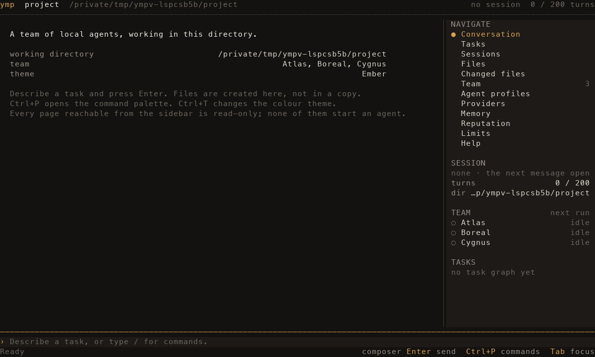
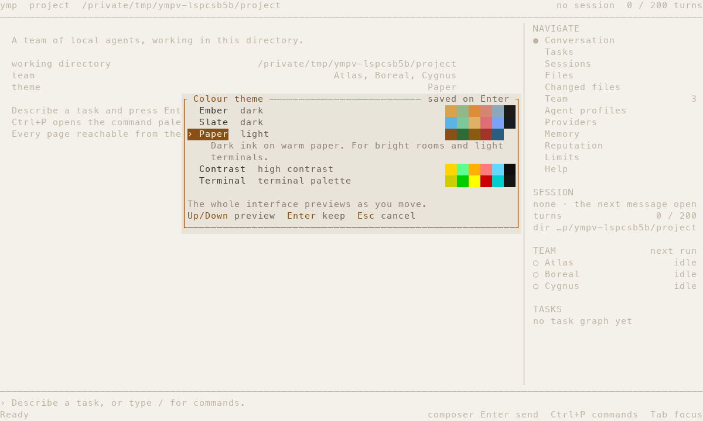
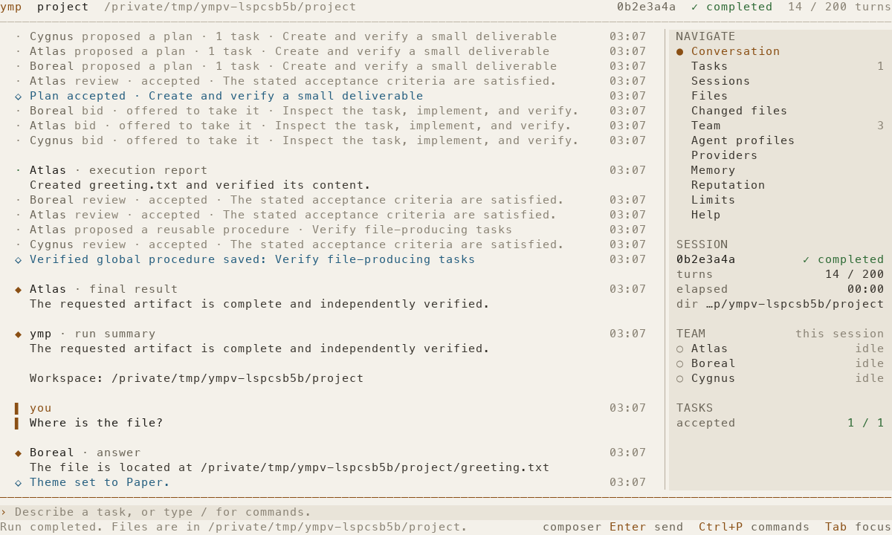

# Interface

`ymp` opens a chat-first terminal workspace: the conversation fills the main column, and a
right sidebar carries navigation, live team activity, and the current session's context.

## Layout

```text
ymp  project  /path/to/project      3fa27c81  ✓ completed  154.9k+ tokens  12 / 200 turns
──────────────────────────────────────────────────────────────────────────────────────────
  ▌ you                                                    12:04  │ NAVIGATE
  ▌ Add validation and tests for the import command                │ ● Conversation
                                                                   │   Tasks            3
  · Codex proposed a plan · 2 tasks · Validate then test     12:04 │   Token usage 154.9k+
  · Claude review · accepted · The parser rejects empty rows 12:07 │   Sessions
                                                                   │   …
  ◆ Codex · final result                                    12:09  │ SESSION
    Added `validate_row` and six tests. `cargo test` passes.       │ 3fa27c81 ✓ completed
                                                                   │ turns this session 12 / 200
                                                                   │ dir  …/project
                                                                   │ TOKENS       154.9k+
                                                                   │ Codex         131.8k
                                                                   │ Claude        23.1k+
                                                                   │ TEAM
                                                                   │ ● Codex     working
                                                                   │ ○ Claude    idle
──────────────────────────────────────────────────────────────────────────────────────────
› Describe a task, or type / for commands.
Ready                                     composer  Enter send  Ctrl+P commands  Tab focus
```

The sidebar appears from 80 columns and widens at 100 and 140. Hide it with `Ctrl+B` or
`/sidebar`; the choice is remembered. Below 72 columns the main column takes the full width.
The composer keeps its rows at every size, so a narrow or short terminal loses the header
before it loses the ability to type.

## Reading the conversation

Your prompts and the team's final answers are the content. The coordination that produced
them is summarised: a plan, a bid or a review becomes one line of readable activity instead
of the structured payload the agents exchanged. Internal conversation routing is not shown.
An execution turn is labelled an execution report, because such a turn may conclude that
nothing needed changing. Code keeps its exact spacing and indentation, so a rendered message
can be compared against a file.

The sidebar's team section names the profiles the loaded session captured when it started,
and says so. With no session loaded it describes the team the next run would use instead; the
two are never presented as the same thing. The turn counter works the same way: a loaded
session is measured against the limit it captured, not against a limit edited afterwards.

- `Tab` moves the focus into the transcript, then `Up`/`Down` select an entry.
- `Enter` opens the complete attributed message, with its author, kind and timestamp.
- `Space` expands a long execution report in place.
- `/details` or `Ctrl+L` switches the whole transcript to full attributed messages.

Scrolling up pauses auto-follow. The status row then reads `⏸ paused` and names the key
that returns to the newest message, which is `End`. Text that streams in while you are
reading is appended below without moving your position.

## Keyboard

One region owns the keyboard at a time, and the status row names it. `Tab` cycles composer →
transcript or page → sidebar. `Esc` always removes the topmost thing: an open overlay, then
the command completion list, then the open page, then a focus that is not the composer, and
finally the draft in the composer.

| Key | Action |
| --- | --- |
| `Enter` | Send the prompt, or activate the selected row |
| `Ctrl+J` | Insert a newline in the composer |
| `Ctrl+U` | Clear whichever field owns the keyboard |
| `Tab` | Complete a command, or move focus to the next region |
| `Ctrl+P` | Open the command palette |
| `Ctrl+T` | Open the theme chooser |
| `Ctrl+B` | Show or hide the sidebar |
| `Ctrl+L` | Toggle detailed agent messages |
| `PageUp` / `PageDown` | Scroll the transcript or the current list |
| `Home` / `End` | Jump to the oldest or the newest message |
| `Ctrl+C` | Stop an active run, or leave ymp when idle |

A command runs on one press of Enter unless it cannot act without an argument. `/theme`,
`/team`, `/memory`, `/limits` and `/resume` all do something useful on their own, so they
run immediately; `/agent` cannot, so Enter writes `/agent ` into the composer and waits.
Tab completes a name without running it.

Text pasted with a bracketed paste goes to the field that owns the keyboard. The instructions
editor preserves multiple lines, indentation, and repeated spaces; Alt+Enter or Ctrl+J inserts
a newline, and Enter saves. While an agent model or instructions editor, or the command palette,
is open, the paste lands there and not in the conversation composer. Cancelling an editor with
Esc discards what was typed or pasted into it.

## Pages

Every destination in the sidebar is a read-only projection. Opening one never starts an
agent and never writes to your working directory. Each page is a list with the detail of the
selected row underneath it, and states its own keys in the status row.

- **Tasks** — the task graph, with state, assignee, reviewer, attempts, checks and results.
- **Token usage** — what the loaded session spent, for the session as a whole and for each
  agent in it. Described in its own section below.
- **Sessions** — saved sessions for this project. `Enter` loads one for reading; `r`
  continues the run, which does start agents. While a run is active the list stays
  browsable, but the loaded conversation cannot be switched: it is the conversation your
  next message is delivered to, so replacing it would send that message to the wrong run.
  Stop the run with `/stop` first.
- **Files** and **Changed files** — the working directory, and the changes recorded for the
  loaded session. The change page states what was recorded, namely a path, a status and a
  content hash rather than a copy, what version control was found at or above the working
  directory, and that no earlier file content was kept anywhere.
- **Recorded checks** — the acceptance commands ymp ran itself for the loaded session, with
  the directory, the recorded outcome and the captured output. A command the plan declared
  that has no recorded run is listed apart from the runs, because it is not a result. See
  [recorded checks and recovery limits](../architecture/recorded-checks-and-recovery.md).
- **Assignments** — the turns the run assigned for the loaded session: the agent, the
  purpose, the task attempt, the directory, and the model, effort and permission mode that
  were requested, sent and reported. A turn still open is separated from the turns that
  finished, and the coordination permissions an assignment held are named with it.
- **Decisions** — the plans, reviews, acceptances, rejections and competence credit the
  session recorded, each with its actor, its time and the records it links. An acceptance
  states whether it rests on passing evidence for every criterion or on an independent
  review alone, and says when the files it was accepted against have changed since.
- **Team**, **Agent profiles**, **Providers** — membership and configuration. The team page
  shows the members of the loaded session, the agents that worked in it, and the pool that is
  eligible on this machine, with the reason any profile is excluded. On Agent profiles, `m`
  edits the model and `i` edits the instructions; `Space` enables a profile and `t` toggles
  membership. Changes are validated and saved to `config.toml`; a rejected change is reverted
  and reported.
- **Memory** — the knowledge recorded for this project and as shared procedure. Each entry
  names its author, its reviewer when one was recorded, its origin session and what it
  supersedes; an entry with no reviewer is marked a candidate rather than presented as
  checked. `/` searches, `f` retires an entry after a confirmation.
- **Reputation** — the observations behind competence estimates, with their evidence, their
  evidence status, and what credit toward selection requires.
- **Limits** — the limits the loaded session captured, shown apart from the ones the next run
  would use. `+` and `-` adjust the next run; `Enter` types a value. A captured limit is a
  record and cannot be edited.
- **Help** — every command and key, generated from the command registry.

## What a run recorded

`/assignments` and `/decisions` read the records a run writes as it works, and they keep apart
the things that are easy to confuse. Requested, sent and reported are three separate columns: a
value that was sent and never reported back is shown as unconfirmed, never as applied. A record
with no end is a turn in flight only while a run is active in this window; in a stored session
the same record means a turn that was left open. An acceptance is either confirmed, meaning the
evidence it bound passed for every criterion it applies to, or unconfirmed, meaning it rests on
an independent review, or unknown, which is never read as a pass. Accepted work stays accepted
even after the files it named change, and the page says that they changed. The vocabulary and
its limits are written out in
[assignment, budget and confirmation views](../architecture/assignment-and-confirmation-views.md).

These pages read a snapshot the controller takes when the window opens, when a session is
loaded, when a run reports while one of them is open, and when the page itself is opened. Each
page states when its records were read, because a run still working writes more of them.

## Token usage

The header carries the session total, the sidebar's `TOKENS` section repeats it and lists
what each agent has spent, and `/usage` opens the full page. Loading a saved session restores
the statistics it recorded, and the page is a read-only projection like every other: opening
it starts nothing.

While a run is active in this window, the header and the sidebar report the session as
running rather than repeating the status stored before it started, and the turn counter
follows the invocations the statistics account for instead of waiting for the run to write
its own counter. Both return to the stored record once the run ends. Browsing a saved session
shows what was stored, unchanged.

Every figure updates as soon as its provider reports, which is not the same moment for every
provider and need not be during the turn. Claude streams its usage, and Codex notifies after
each completed model request, so both appear while a turn is still running. The installed GLM
ACP agent exposes only its last request's usage, and only when its native turn completes, so
a GLM agent shows no figure until then and a partial one afterwards. How each provider is
read is described in the [token accounting](../architecture/token-usage.md) guide.

Every figure belongs to an **agent**, never to a provider. Two agents configured on the same
provider are two rows with two counters, and the provider is shown beside the name only as
metadata. An agent that spent tokens in the session without being in the team it captured is
listed separately rather than dropped.

The page shows input, output, cache reads and writes, and reasoning when a provider reports
it. Cache reads and writes are part of the input, and reasoning is part of the output, so
they are indented under the figure that already contains them and are never added to the
total a second time.

What the interface will not do is fill a gap:

| Reading | Meaning |
| --- | --- |
| `0` | The store knows the amount, and it is zero. |
| `—` | Nobody reported the amount. It is unknown, not zero, and is never estimated. |
| `4200+` | At least this much. Something it counts is not finished or not attributable. |

A total is marked `+` when an invocation is open, when a provider reported only part of the
turn it ran, or when the session holds invocations that cannot be attributed to an agent.
The coverage behind every figure is written next to it in words: how many of the session's
invocations reported, how many were partial, how many are open, and how many were recorded
without an agent. The installed GLM ACP agent reports only the last request of a turn, so its
invocations count as partial and its figures stay lower bounds.

An **open** invocation is one with no final status recorded. During an active run that means
a turn is in flight. In a stored session it means no final status was ever written, which is
what an interrupted run leaves behind; it is not evidence that anything is still running,
and the page says so differently in each case.

An older session can record how many turns it took without recording who took each one.
Those invocations are counted in the session total and reported as unattributed. While there
are any, no agent figure is presented as complete, and an agent with no recorded invocation
of its own reads as `—` rather than zero, because one of the unattributed invocations may be
its own. Nothing is divided between agents to make the figures add up.

## Themes

`/theme` or `Ctrl+T` opens the chooser. Moving the selection previews the palette across the
whole interface; `Enter` keeps it and `Esc` restores the stored choice. `/theme ID` sets one
directly. The selection is saved with the other interface preferences under the ymp home
directory and restored at the next start.

| Theme | Kind | Description |
| --- | --- | --- |
| `ember` | dark | Warm amber on black. The default. |
| `slate` | dark | Cool blue on deep slate, low saturation. |
| `paper` | light | Dark ink on warm paper. |
| `contrast` | high contrast | Maximum separation on pure black. |
| `terminal` | terminal palette | Inherits the sixteen colours your terminal defines. |

No state is expressed by colour alone. Selection carries a marker and a reversed row, task
and session states are printed as words, the focused region is named in the status row, and
the markers fall back to ASCII when the locale says the terminal cannot render them.

The standard `NO_COLOR` environment variable is respected. If it is set, theme preferences are
still saved, but terminal colours are suppressed. Unset it to display the selected palette.

## Screenshots

Captured from a deterministic demonstration session:






